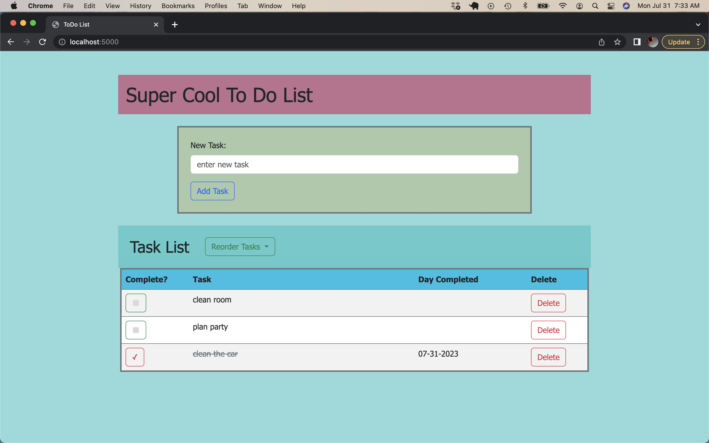

# To Do List

## Description

_Weekend Challenge_

This project is a to do list creator for entering and storing to do list tasks. 

## Screen Shot 

### Prerequisites

- [Node.js](https://nodejs.org/en/)

## Installation

1. Create a database named `weekend_to_do_app`,
2. The queries in the `database.sql` file are set up to create all the necessary tables and populate the needed data to allow the application to run correctly. The project is built on [Postgres](https://www.postgresql.org/download/), so you will need to make sure to have that installed. We recommend using Postico to run those queries as that was used to create the queries, 
3. Open up your editor of choice and run an `npm install`
4. Run `npm run server` in your terminal
5. Run `npm run client` in your terminal
6. The `npm run client` command will open up a new browser tab for you!

## Usage
How does someone use this application? Tell a user story here.

1. Users can enter in new tasks which will be stored in the database and added to a task list on the page
2. A button to reorder the list gives a drop down menu to reorder the list newest to oldest or oldest to newest
3. Each task row has a button that can be clicked to mark the task as complete, this will also display the day the task was marked complete
4. Each task row also has a delete button which triggers a confirmation pop up window.
5. If the user selects yes on the confirmation pop up the task is deleted

## Built With

- Javascript
- JQuery
- Express
- Bootstrap 5
- Sweet Alert

## Acknowledgement
Thanks to [Prime Digital Academy](www.primeacademy.io) who equipped and helped me to make this application a reality. 

